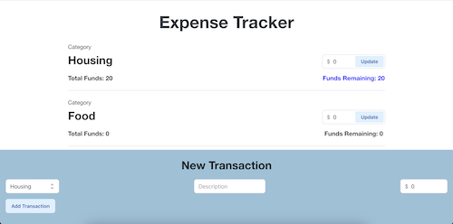
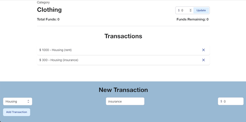
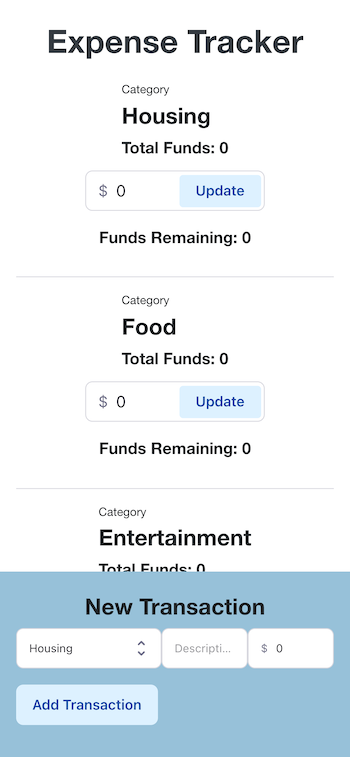

# Expense Tracker

A project helps to track the spending and remaining funds. The website is responsive. It's a practice of managing [React](https://reactjs.org) state with [Redux](https://redux.js.org) and [Redux Toolkit](https://redux-toolkit.js.org).

View the deploy website: https://ruxinqu.github.io/expense-tracker/

## Usage

1. Enter the budget for each category and click the button _Update_
2. Add transactions through the _New Tranction_ form
3. Keep track of the transactions and remaining funds!

### Screenshots

## Technologies Used

- [React](https://reactjs.org)
- [Redux](https://redux.js.org)
- [Redux Toolkit](https://redux-toolkit.js.org)
- [Material UI](https://mui.com)
